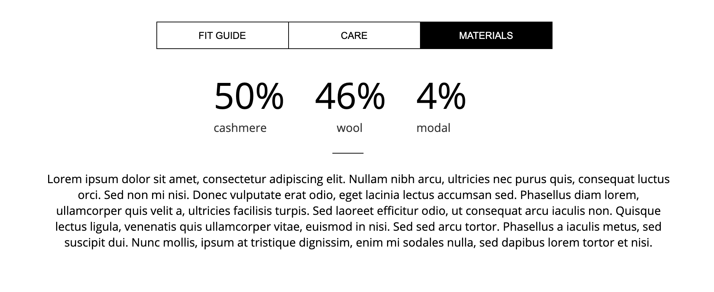
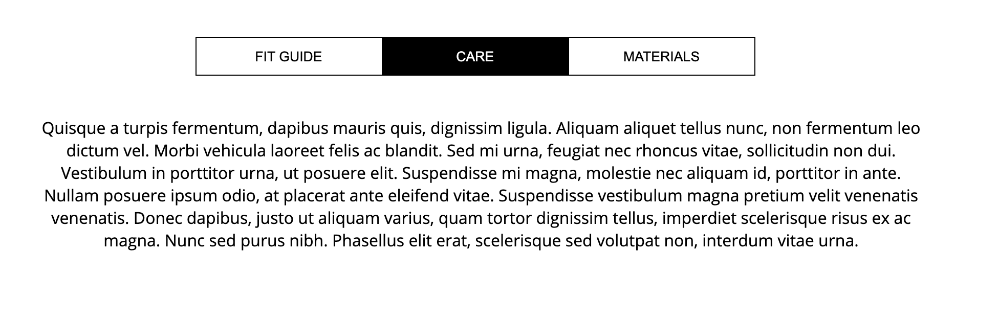
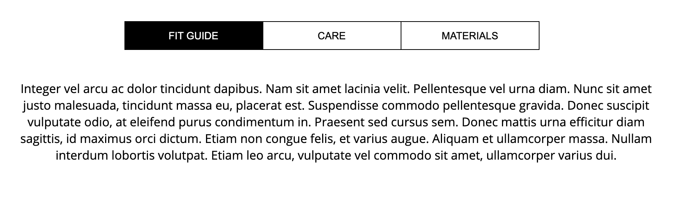
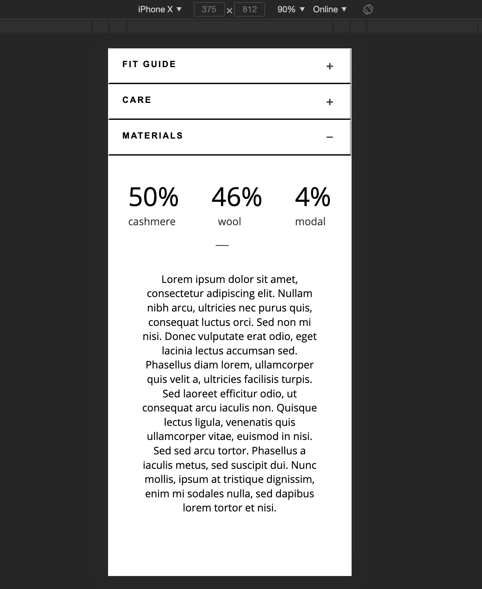
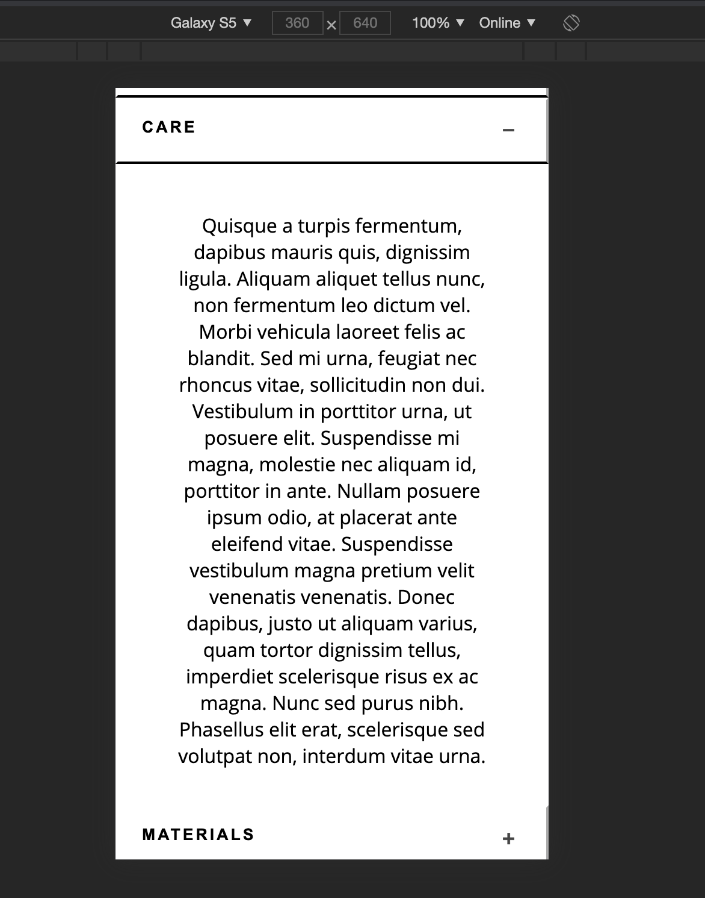

**To run the web application**

- Click on the index.html file and it will open application on your default web browser on mobile(IOS,Android) as well as on desktop(Safari,IE,Firefox,Chrome).

*Files:*
- index.html file consists of the html code for both mobile as well as deskop application
- styles.css has css for bothe media type
- scripts.js file consists of the JavaScript to control behaviour of accordian as well as tabs

* Attached is the screenshot of the images of web application build by me:

*Desktop View*

- Material view:

- Care View:

- Fit Guide View:

*Mobile View*

- Material view:

- Care View:

